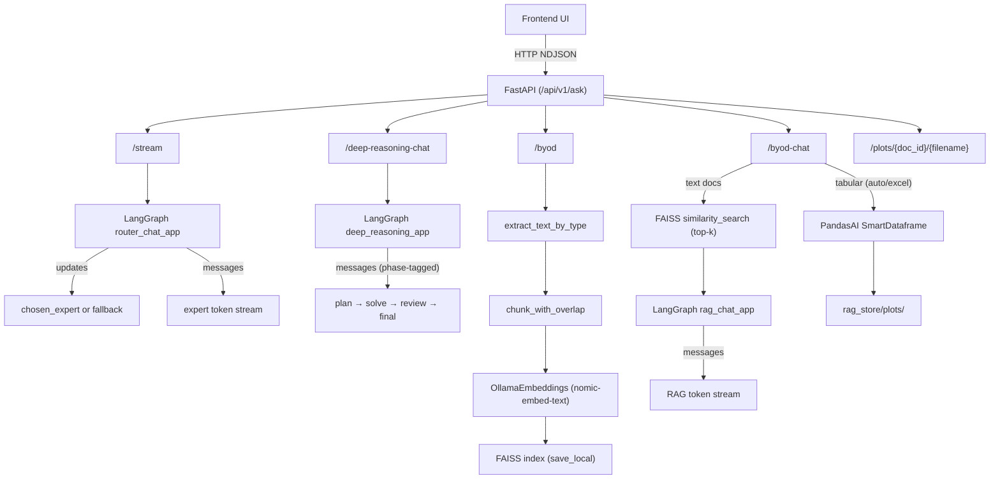
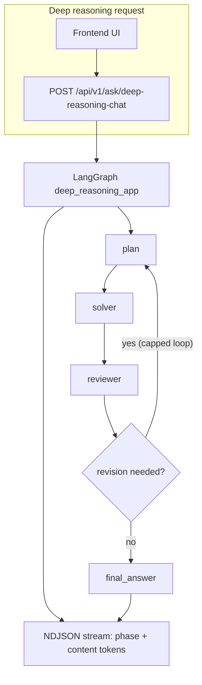

# From Upload to Grounded Answers: A FastAPI + FAISS + LangGraph RAG Assistant

**Streaming expert routing, BYOD RAG, and a separate “Excel mode” for real spreadsheet questions—local‑first with Ollama.**

Most “chat app” demos stop at a single prompt → single answer. I wanted something closer to a practical assistant:

- It should **stream tokens** so the UI feels responsive.
- It should **route questions** to the right “expert” instead of using one generic prompt.
- It should **ground answers** in documents I upload (BYOD), including PDFs and spreadsheets.
- And when the input is a spreadsheet, it should behave like a **data analysis tool**, not a text retriever.

This post walks through the architecture and the engineering decisions behind a FastAPI + React app that combines **streaming**, **expert routing**, **RAG with FAISS persistence**, and **Excel/CSV Q&A with plots**, all while staying **local‑first** via Ollama.

---

## Links

- **Source code**: `https://github.com/aneshr/council_of_experts`
- **GitHub profile**: `https://github.com/aneshr`

---

## What I built (in one view)

The system has a few “lanes” that reuse the same core ideas:

- **Streaming expert chat** (`/api/v1/ask/stream`)  
  Routes the user’s question to the best expert and streams back NDJSON.
- **BYOD ingestion** (`/api/v1/ask/byod`)  
  Extracts text, chunks it, embeds locally, and persists a FAISS index on disk.
- **RAG chat** (`/api/v1/ask/byod-chat`)  
  Retrieves top‑k chunks from FAISS, builds context with simple citations, and streams the grounded answer.
- **Tabular (Excel/CSV) Q&A** (via `doc_id` + PandasAI)  
  For spreadsheet questions, routes to a PandasAI path and can return plot URLs.
- Bonus capabilities: **voice** (Whisper transcription) and **vision** (LLaVA via Ollama), reused through the same routing + streaming format.

---

## Architecture (end‑to‑end)

> Medium doesn’t reliably render Mermaid diagrams. Best approach: render this diagram as an image (screenshot from your editor) and upload the image into the Medium post.



---

## 1) Streaming first: designing the wire format

If a model takes 10 seconds, a non‑streaming UI feels broken. So the backend streams **newline‑delimited JSON (NDJSON)**. Each line is a JSON object that the frontend can parse and append immediately.

NDJSON also gives you a clean protocol:

- token chunks: `{"content": "..."}` or `{"expert": "...", "content": "..."}`
- lifecycle markers: `{"event": "end"}`

In this project, `/ask/stream` streams expert tokens and ends with an explicit end event:

```python
# See: app/routes/chat.py → /api/v1/ask/stream
# Output format (example):
{"expert": "Science", "content": "Quantum"}
{"expert": "Science", "content": " computing"}
{"expert": "Science", "event": "end"}
```

Trade‑off: streaming forces discipline (stable event format, clear “end”). The payoff is huge: the UI stays alive, and failures are easier to communicate.

---

## 2) Expert routing: one assistant, multiple “personas”

Instead of forcing every question through one prompt, the backend routes a question to one of the configured experts.

Importantly, the router accepts an **arbitrary-length list of experts per request** (2 experts, 5 experts, 10 experts, etc.)—it’s not limited to a fixed number.

Architecturally, this stays simple:

- Router chooses an expert label (or “None”)
- If confident, stream the expert’s answer
- If not, produce a safe fallback response

This pattern scales well: adding experts is mostly prompt/design work, not a rewrite of the chat system.

---

## 3) Deep reasoning: plan → solve → review (with revision loops)

Some questions aren’t best handled by “answer immediately.” For multi-step problems, this project includes a **deep reasoning** flow exposed as `/api/v1/ask/deep-reasoning-chat`.

Instead of a single generation pass, it runs a small graph:

- **plan**: create an approach
- **solve**: produce an answer using the plan
- **review**: critique the answer and decide whether a revision is needed
- **final**: return the final response (or loop back up to a capped number of revisions)

Streaming is still first-class: the API streams tokens as NDJSON, but includes a **`phase`** so the UI can show “thinking” briefly and keep only the final answer if desired.

> Same as the main architecture diagram: Medium may not render Mermaid reliably—export this block as an image (e.g. from `docs/architecture_diagram_for_medium.html` or any Mermaid renderer) and upload it into your Medium post.



---

## 4) BYOD ingestion: the RAG foundation

For BYOD, I wanted a pipeline that is easy to reason about and persists across restarts:

1) detect file type  
2) extract text  
3) chunk (with overlap)  
4) embed locally  
5) store in FAISS on disk

Supported types include `.txt`, `.md`, `.pdf`, `.docx`, `.xlsx`, `.xls`, `.csv`. Extraction + chunking happens before embedding, and embeddings are local‑first (Ollama).

Why persistence matters: you can ingest once and reuse the index without rebuilding every time you restart the backend.

---

## 5) RAG chat: retrieval + lightweight citations + streaming

Once the index exists, `/byod-chat` retrieves top‑k chunks, formats them into a context block with labels, then streams the answer from a RAG graph.

The key idea is the **debuggable context format**. Instead of dumping raw chunks, it prepends labels like `[1] (doc_name)` so you can quickly see what retrieval returned and what the model should be grounded on.

This separation also makes iteration easier:

- Improve chunking/retrieval without touching the generation graph
- Improve prompting/citation formatting without changing the index format

---

## 6) Why spreadsheets need a separate path (“Excel mode”)

A spreadsheet isn’t a document in the “read and quote paragraphs” sense—it’s a dataset. Many spreadsheet questions are about:

- grouping / aggregation
- filtering
- sorting
- visualization

For that, plain text retrieval is usually the wrong tool. So this project supports a tabular route: load the file by `doc_id`, ask a PandasAI engine, and return both an answer and optional plot URLs.

When charts aren’t produced, a lightweight fallback plot generator can still create something useful so the UI has a visual result.

---

## 7) Bonus: voice + vision (optional)

Multimodal inputs work best when you reuse the same routing + streaming core after converting inputs into text:

- voice → transcript → router → stream
- image → LLaVA summary → router → stream

This keeps the system modular: “input adapters” (Whisper, LLaVA) feed the same chat pipeline.

---

## 8) What I’d improve next

- **Chunking**: token‑aware or semantic chunking; tune overlap; handle headings/sections.
- **Scoped retrieval**: filter by `doc_id` / tags so retrieval isn’t global.
- **Evaluation**: a small golden set per doc; track retrieval hit‑rate, latency, and groundedness.
- **Performance**: background ingestion, caching, timeouts for local model calls.
- **Security**: upload limits, MIME sniffing, and stricter file handling rules.

---

## Run locally (quick start)

- **Backend**
  - Install: `pip install -r requirements.txt`
  - Run: `uvicorn app.main:app --reload --host 0.0.0.0 --port 8000`
- **Ollama**
  - Start: `ollama serve`
  - Ensure embedding model is available (used for ingestion): `nomic-embed-text`
- **Frontend**
  - `cd Frontend && npm install && npm run dev`
- **Docs**
  - `http://localhost:8000/docs`

---

## Screenshots to include (recommended)

Put these screenshots directly into the Medium post (drag-and-drop works).

### Suggested screenshot set (best for this article)

- **Cover image (optional, but recommended)**: a clean app UI shot (Experts Council screen) or the architecture diagram rendered as an image.
- **01 — Streaming expert chat**: capture while tokens are actively streaming.
  - Suggested filename: `medium_screenshots/01_streaming_expert_chat.png`
  - Place it in section **“1) Streaming first…”**
- **02 — BYOD upload success**: show the ingest response with **`doc_id`** and **`num_chunks`** visible.
  - Suggested filename: `medium_screenshots/02_byod_upload_response.png`
  - Place it in section **“3) BYOD ingestion…”**
- **03 — BYOD chat answer**: show the answer and (if visible) the evidence/citation formatting.
  - Suggested filename: `medium_screenshots/03_byod_chat.png`
  - Place it in section **“4) RAG chat…”**
- **04 — Excel/CSV Q&A + plot (optional)**: show one plot image and the answer payload.
  - Suggested filename: `medium_screenshots/04_excel_plot.png`
  - Place it in section **“5) Why spreadsheets…”**

### Screenshot tips (so they look good on Medium)

- Use a wide viewport (e.g. ~1440×900) and avoid dark terminal clutter in the background.
- Blur or crop anything that could reveal private paths, usernames, tokens, or uploaded private content.
- For the architecture diagram: screenshot the Mermaid render and upload it as a normal image (Medium is inconsistent with Mermaid rendering).

---

## Pre‑publish checklist (don’t leak sensitive files)

- Don’t include personal files (resumes, personal images) in the repo or screenshots.
- Don’t publish generated vector indexes built from private docs.
- Double-check that no secrets/tokens appear in terminal output or screenshots.

